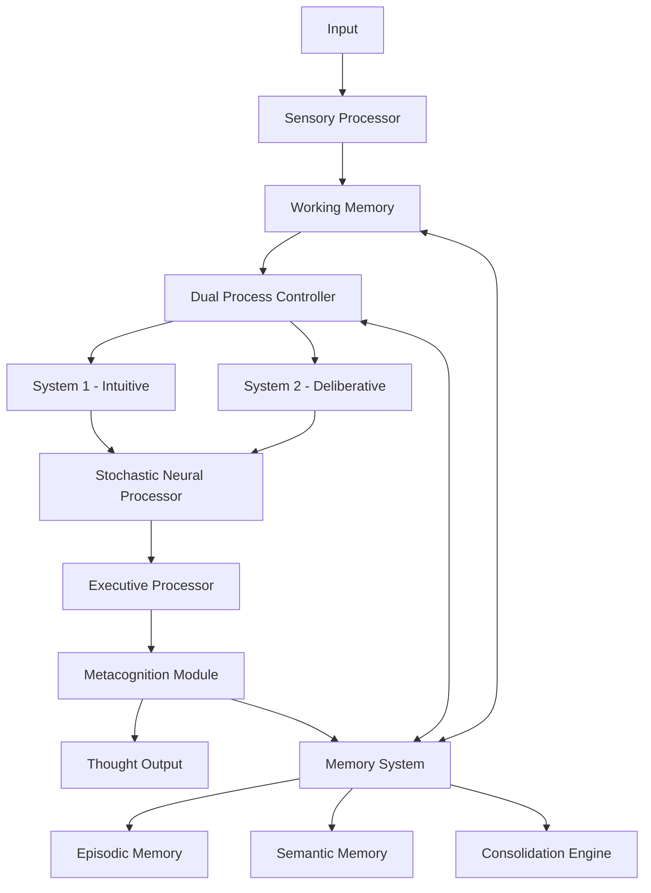

# ThoughtMCP Documentation

Welcome to the comprehensive documentation for ThoughtMCP, an MCP server implementing human-like cognitive architecture for enhanced AI reasoning.

## Documentation Structure

### 📚 API Documentation

- **[Cognitive Tools API](api/cognitive-tools.md)** - Complete API reference for all four cognitive tools
- **[Tool Schemas](api/tools/)** - Detailed schemas and examples for each tool

### 🏗️ Architecture Documentation

- **[Cognitive Architecture Guide](architecture/cognitive-architecture-guide.md)** - Deep dive into the cognitive architecture design and components
- **[Architecture Overview](architecture/README.md)** - High-level architectural concepts

### ⚡ Performance Documentation

- **[Benchmarking Guide](performance/benchmarking-guide.md)** - Comprehensive performance testing and optimization strategies

### 🚀 Getting Started

- **[Installation Guide](getting-started/installation.md)** - Step-by-step installation instructions
- **[Basic Concepts](getting-started/basic-concepts.md)** - Core concepts and terminology
- **[Quick Start](getting-started/README.md)** - Get up and running quickly

### 📖 Examples and Guides

- **[Usage Examples](examples/)** - Practical examples and use cases
- **[Configuration Guide](guides/configuration.md)** - Configuration options and tuning

### 🔬 Development

- **[Contributing Guide](development/contributing.md)** - How to contribute to the project
- **[Development Setup](development/README.md)** - Setting up the development environment

### 🔍 Research

- **[Research Background](research/README.md)** - Scientific background and references

## Quick Navigation

### For Developers

- [API Reference](api/cognitive-tools.md) - Start here for API integration
- [Examples](../examples/README.md) - Practical code examples
- [Performance Guide](performance/benchmarking-guide.md) - Optimization strategies

### For Researchers

- [Cognitive Architecture](architecture/cognitive-architecture-guide.md) - Detailed architecture explanation
- [Research Background](research/README.md) - Scientific foundations

### For System Administrators

- [Installation Guide](getting-started/installation.md) - Deployment instructions
- [Configuration Guide](guides/configuration.md) - System configuration
- [Performance Monitoring](performance/benchmarking-guide.md) - Monitoring and optimization

## Key Features

### 🧠 Human-Like Cognitive Processing

- **Dual-Process Thinking**: System 1 (intuitive) and System 2 (deliberative) processing
- **Memory Systems**: Episodic and semantic memory with consolidation
- **Emotional Processing**: Somatic markers and emotional modulation
- **Metacognitive Monitoring**: Self-awareness and bias detection

### 🔧 Eight Cognitive Tools

#### Core Cognitive Tools

1. **`think`** - Process input through cognitive architecture
2. **`remember`** - Store information in memory systems
3. **`recall`** - Retrieve memories based on cues
4. **`analyze_reasoning`** - Analyze reasoning for quality and biases

#### Advanced Reasoning Tools

5. **`analyze_systematically`** - Apply proven thinking frameworks automatically
6. **`think_parallel`** - Multi-stream reasoning with conflict resolution
7. **`decompose_problem`** - Break complex problems into manageable components
8. **`think_probabilistic`** - Bayesian reasoning with uncertainty quantification

### 🎯 Processing Modes

- **Intuitive**: Fast pattern matching for familiar problems
- **Deliberative**: Slow, careful reasoning for complex issues
- **Creative**: High variability for innovation and brainstorming
- **Analytical**: Structured reasoning for technical problems
- **Balanced**: Adaptive processing that switches modes as needed

### 📊 Performance Features

- **Configurable Parameters**: Tune for speed vs. quality trade-offs
- **Comprehensive Monitoring**: Built-in performance metrics and health checks
- **Scalable Architecture**: Support for concurrent sessions and horizontal scaling

## Getting Started

### Quick Start

```bash
# Install dependencies
npm install

# Build the project
npm run build

# Start the server
npm start

# Run examples (in another terminal)
npm run example:demo
```

### Basic Usage

```typescript
import { Client } from "@modelcontextprotocol/sdk/client/index.js";
import { StdioClientTransport } from "@modelcontextprotocol/sdk/client/stdio.js";

// Connect to ThoughtMCP server
const transport = new StdioClientTransport({
  command: "node",
  args: ["dist/index.js"],
});

const client = new Client({ name: "my-app", version: "1.0.0" }, {});
await client.connect(transport);

// Use cognitive thinking
const result = await client.request({
  method: "tools/call",
  params: {
    name: "think",
    arguments: {
      input: "What are the implications of quantum computing?",
      mode: "deliberative",
    },
  },
});

console.log(result.content.content);
```

## Architecture Overview

ThoughtMCP implements a sophisticated cognitive architecture inspired by neuroscience and cognitive psychology:



### Core Components

1. **Sensory Processing**: Filters and normalizes input information
2. **Working Memory**: Temporarily holds and manipulates information
3. **Dual-Process Controller**: Manages intuitive vs. deliberative thinking
4. **Memory Systems**: Stores and retrieves episodic and semantic memories
5. **Emotional Processing**: Adds emotional context and somatic markers
6. **Metacognitive Monitoring**: Self-monitors reasoning quality and biases
7. **Predictive Processing**: Generates predictions and updates models
8. **Stochastic Neural Processing**: Adds biological-like variability

## Use Cases

### 🎓 Educational Applications

- Intelligent tutoring systems with human-like reasoning
- Adaptive learning platforms that understand student thinking
- Research assistants that can reason about complex topics

### 💼 Business Applications

- Strategic planning tools with multi-perspective analysis
- Decision support systems with bias detection
- Customer service agents with emotional intelligence

### 🔬 Research Applications

- Cognitive modeling and simulation
- AI reasoning research and development
- Human-AI collaboration studies

### 🏥 Healthcare Applications

- Clinical decision support with reasoning transparency
- Medical education tools with expert-level reasoning
- Patient interaction systems with empathy

## Performance Characteristics

### Typical Response Times

- **Intuitive Mode**: 50-200ms
- **Deliberative Mode**: 200-1000ms
- **Creative Mode**: 200-800ms
- **Analytical Mode**: 300-600ms
- **Balanced Mode**: 100-500ms

### Resource Requirements

- **Memory**: 500MB-2GB depending on configuration
- **CPU**: Benefits from multi-core processors
- **Storage**: 100MB-1GB for memory persistence
- **Network**: Standard MCP protocol overhead

### Scalability

- **Concurrent Sessions**: 50-500+ depending on hardware
- **Throughput**: 10-100+ requests/second per instance
- **Horizontal Scaling**: Supported with distributed memory

## Configuration Examples

### High Performance

```typescript
const fastConfig = {
  mode: "intuitive",
  max_depth: 6,
  temperature: 0.4,
  enable_emotion: false,
  enable_metacognition: false,
};
```

### High Quality

```typescript
const qualityConfig = {
  mode: "deliberative",
  max_depth: 15,
  temperature: 0.7,
  enable_emotion: true,
  enable_metacognition: true,
};
```

### Creative

```typescript
const creativeConfig = {
  mode: "creative",
  max_depth: 12,
  temperature: 1.2,
  enable_emotion: true,
  stochastic: { noise_level: 0.15 },
};
```

## Contributing

We welcome contributions! Please see our [Contributing Guide](development/contributing.md) for details on:

- Code style and standards
- Testing requirements
- Pull request process
- Development setup

## Support

- **Issues**: [GitHub Issues](https://github.com/keyurgolani/ThoughtMcp/issues)
- **Discussions**: [GitHub Discussions](https://github.com/keyurgolani/ThoughtMcp/discussions)
- **Documentation**: This documentation site
- **Examples**: [Examples Directory](../examples/)

## License

This project is licensed under the MIT License. See the [LICENSE](../LICENSE) file for details.

## Acknowledgments

This project builds upon decades of research in cognitive science, neuroscience, and artificial intelligence. We acknowledge the contributions of researchers in:

- Dual-process theory (Kahneman, Stanovich)
- Hierarchical temporal memory (Hawkins, Ahmad)
- Predictive processing (Friston, Clark)
- Emotional decision-making (Damasio, Bechara)
- Metacognition (Flavell, Nelson)

---

**Ready to get started?** Check out the [Quick Start Guide](getting-started/README.md) or explore the [API Documentation](api/cognitive-tools.md)!
