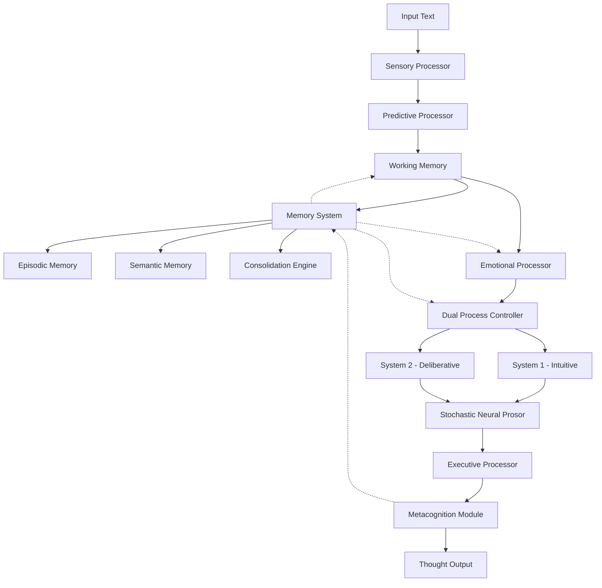
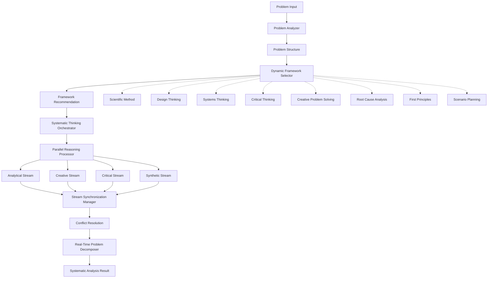

# Cognitive Architecture Guide

## Introduction

The ThoughtMCP cognitive architecture implements a sophisticated model of human-like thinking processes, drawing from neuroscience, cognitive psychology, and complex systems theory. This guide explains the architecture's design principles, components, and how to tune them for optimal performance.

## Architectural Overview

### Biological Inspiration

The architecture is inspired by several key findings from cognitive neuroscience:

1. **Dual-Process Theory**: Human thinking operates through two systems - fast intuitive processing (System 1) and slow deliberative reasoning (System 2)
2. **Hierarchical Temporal Memory**: The brain processes information through multiple hierarchical layers with temporal integration
3. **Predictive Processing**: The brain constantly generates predictions and updates models based on prediction errors
4. **Emotional Modulation**: Emotions significantly influence decision-making through somatic markers
5. **Metacognitive Monitoring**: Humans continuously monitor and adjust their thinking processes

### System Architecture



## Core Components

### 1. Sensory Processing Layer

**Purpose**: Normalizes and filters input information, mimicking early sensory processing in the brain.

**Key Functions**:

- **Tokenization**: Breaks input into semantic chunks
- **Attention Filtering**: Focuses on relevant information (thalamic gating)
- **Pattern Detection**: Identifies recurring patterns and structures
- **Salience Computation**: Ranks information by relevance

**Configuration Parameters**:

```typescript
interface SensoryConfig {
  attention_threshold: number; // 0.0-1.0, default: 0.3
  max_tokens: number; // Default: 1000
  pattern_detection: boolean; // Default: true
  semantic_chunking: boolean; // Default: true
}
```

**Tuning Guidelines**:

- **Lower attention_threshold (0.1-0.3)**: More information passes through, better for complex analysis
- **Higher attention_threshold (0.4-0.7)**: More focused processing, better for simple tasks
- **Disable pattern_detection**: Faster processing for simple inputs
- **Enable semantic_chunking**: Better understanding of complex texts

### 2. Working Memory Module

**Purpose**: Temporarily holds and manipulates information, implementing Miller's 7±2 capacity limitation.

**Key Functions**:

- **Capacity Management**: Limits active information chunks
- **Decay Mechanisms**: Information fades over time without rehearsal
- **Chunking**: Groups related information for efficient storage
- **Rehearsal**: Maintains important information in active state

**Configuration Parameters**:

```typescript
interface WorkingMemoryConfig {
  capacity: number; // Default: 7 (Miller's number)
  decay_rate: number; // 0.0-1.0, default: 0.1
  rehearsal_threshold: number; // 0.0-1.0, default: 0.5
  chunking_enabled: boolean; // Default: true
}
```

**Tuning Guidelines**:

- **Increase capacity (8-12)**: Better for complex reasoning, higher memory usage
- **Decrease capacity (4-6)**: Faster processing, more focused thinking
- **Lower decay_rate (0.05-0.08)**: Information persists longer
- **Higher decay_rate (0.15-0.25)**: More dynamic, responsive to new information

### 3. Dual-Process Controller

**Purpose**: Implements Kahneman's dual-process theory with System 1 (intuitive) and System 2 (deliberative) thinking.

#### System 1 (Intuitive Processing)

- **Speed**: Very fast (50-200ms)
- **Method**: Pattern matching, heuristics, cached responses
- **Use Cases**: Familiar problems, quick decisions, first impressions
- **Characteristics**: Automatic, effortless, emotional

#### System 2 (Deliberative Processing)

- **Speed**: Slower (200-1000ms)
- **Method**: Systematic reasoning, logical analysis, step-by-step evaluation
- **Use Cases**: Novel problems, important decisions, complex analysis
- **Characteristics**: Controlled, effortful, logical

**Configuration Parameters**:

```typescript
interface DualProcessConfig {
  conflict_threshold: number; // 0.0-1.0, default: 0.7
  system2_timeout: number; // milliseconds, default: 5000
  confidence_weighting: number; // 0.0-1.0, default: 0.8
  mode_bias: "system1" | "system2" | "balanced"; // default: "balanced"
}
```

**Tuning Guidelines**:

- **Lower conflict_threshold (0.4-0.6)**: System 2 activates more often, slower but more thorough
- **Higher conflict_threshold (0.8-0.9)**: More reliance on System 1, faster responses
- **Increase system2_timeout**: Allow more time for complex reasoning
- **Adjust mode_bias**: Bias toward specific processing style

### 4. Memory Systems

#### Episodic Memory

**Purpose**: Stores personal experiences with temporal and contextual information.

**Characteristics**:

- Time-stamped experiences
- Rich contextual information
- Emotional tagging
- Decay over time
- Context-dependent retrieval

**Configuration**:

```typescript
interface EpisodicMemoryConfig {
  capacity: number; // Default: 10000
  decay_rate: number; // Default: 0.01 per day
  retrieval_threshold: number; // Default: 0.3
  context_weighting: number; // Default: 0.6
  emotional_boost: number; // Default: 1.5
}
```

#### Semantic Memory

**Purpose**: Stores factual knowledge and concepts without temporal context.

**Characteristics**:

- Timeless factual information
- Concept hierarchies
- Embedding-based similarity
- Resistant to decay
- Association networks

**Configuration**:

```typescript
interface SemanticMemoryConfig {
  embedding_dimension: number; // Default: 768
  similarity_metric: "cosine" | "euclidean"; // Default: "cosine"
  clustering_threshold: number; // Default: 0.7
  concept_hierarchy: boolean; // Default: true
}
```

#### Consolidation Engine

**Purpose**: Transfers patterns from episodic to semantic memory, mimicking sleep consolidation.

**Process**:

1. **Pattern Detection**: Identifies recurring themes across
   **Importance Assessment**: Evaluates which patterns to consolidate
2. **Knowledge Extraction**: Creates semantic knowledge from episodic patterns
3. **Memory Pruning**: Removes redundant or low-importance memories

**Configuration**:

```typescript
interface ConsolidationConfig {
  consolidation_interval: number; // milliseconds, default: 3600000 (1 hour)
  pattern_threshold: number; // Default: 0.6
  importance_threshold: number; // Default: 0.5
  pruning_enabled: boolean; // Default: true
  max_consolidation_time: number; // milliseconds, default: 30000
}
```

### 5. Emotional Processing System

**Purpose**: Assesses emotional content and applies somatic markers to influence decision-making.

**Key Functions**:

- **Emotional Assessment**: Evaluates valence, arousal, and dominance
- **Somatic Markers**: Associates decision patterns with emotional outcomes
- **Decision Modulation**: Biases choices based on emotional context
- **State Tracking**: Maintains current emotional state

**Configuration Parameters**:

```typescript
interface EmotionalConfig {
  emotional_influence: number; // 0.0-1.0, default: 0.3
  somatic_marker_strength: number; // 0.0-1.0, default: 0.5
  emotional_memory: boolean; // Default: true
  valence_sensitivity: number; // 0.0-1.0, default: 0.7
  arousal_threshold: number; // 0.0-1.0, default: 0.4
}
```

**Tuning Guidelines**:

- **Increase emotional_influence (0.4-0.7)**: More emotion-driven decisions
- **Decrease emotional_influence (0.1-0.2)**: More rational, logical decisions
- **Higher somatic_marker_strength**: Stronger gut feeling influence
- **Adjust valence_sensitivity**: How much positive/negative emotions matter

### 6. Metacognitive Monitoring

**Purpose**: Monitors thinking processes for quality, coherence, and biases.

**Monitoring Dimensions**:

- **Confidence**: How certain the system is about its conclusions
- **Coherence**: Logical consistency of reasoning steps
- **Completeness**: Whether all relevant aspects were considered
- **Bias Detection**: Identification of cognitive biases

**Configuration Parameters**:

```typescript
interface MetacognitionConfig {
  confidence_threshold: number; // 0.0-1.0, default: 0.6
  coherence_weight: number; // 0.0-1.0, default: 0.4
  bias_detection: boolean; // Default: true
  self_correction: boolean; // Default: true
  monitoring_depth: number; // 1-5, default: 3
}
```

**Common Biases Detected**:

- **Confirmation Bias**: Seeking information that confirms existing beliefs
- **Anchoring Bias**: Over-relying on first information received
- **Availability Heuristic**: Overestimating likelihood of memorable events
- **Representativeness Heuristic**: Judging probability by similarity to mental prototypes
- **Overconfidence Bias**: Overestimating accuracy of beliefs

### 7. Predictive Processing Framework

**Purpose**: Implements predictive coding theory where the brain constantly generates predictions and updates models based on errors.

**Key Functions**:

- **Prediction Generation**: Creates expectations based on context
- **Error Computation**: Measures difference between predictions and reality
- **Model Updating**: Adjusts internal models based on prediction errors
- **Bayesian Integration**: Combines prior beliefs with new evidence

**Configuration Parameters**:

```typescript
interface PredictiveConfig {
  prediction_strength: number; // 0.0-1.0, default: 0.6
  error_threshold: number; // 0.0-1.0, default: 0.3
  learning_rate: number; // 0.0-1.0, default: 0.1
  bayesian_updating: boolean; // Default: true
  hierarchical_levels: number; // 1-5, default: 3
}
```

### 8. Stochastic Neural Processing

**Purpose**: Adds biological-like noise and variability to prevent deterministic thinking patterns.

**Key Functions**:

- **Gaussian Noise Addition**: Simulates neural variability
- **Stochastic Resonance**: Uses noise to enhance weak signal detection
- **Probabilistic Sampling**: Samples from probability distributions
- **Temperature Control**: Adjusts randomness levels

**Configuration Parameters**:

```typescript
interface StochasticConfig {
  noise_level: number; // 0.0-1.0, default: 0.1
  temperature: number; // 0.0-2.0, default: 0.7
  stochastic_resonance: boolean; // Default: true
  sampling_method: "deterministic" | "probabilistic"; // Default: "probabilistic"
}
```

## Processing Modes Deep Dive

### Intuitive Mode Configuration

```typescript
const intuitiveConfig = {
  sensory: { attention_threshold: 0.4 },
  working_memory: { capacity: 5, decay_rate: 0.15 },
  dual_process: { mode_bias: "system1", conflict_threshold: 0.8 },
  stochastic: { temperature: 0.3, noise_level: 0.05 },
  metacognition: { monitoring_depth: 1 },
};
```

### Deliberative Mode Configuration

```typescript
const deliberativeConfig = {
  sensory: { attention_threshold: 0.2 },
  working_memory: { capacity: 9, decay_rate: 0.05 },
  dual_process: { mode_bias: "system2", conflict_threshold: 0.4 },
  stochastic: { temperature: 0.5, noise_level: 0.08 },
  metacognition: { monitoring_depth: 5 },
};
```

### Creative Mode Configuration

```typescript
const creativeConfig = {
  sensory: { attention_threshold: 0.3 },
  working_memory: { capacity: 8, decay_rate: 0.12 },
  dual_process: { mode_bias: "balanced", conflict_threshold: 0.6 },
  stochastic: { temperature: 1.2, noise_level: 0.15 },
  emotional: { emotional_influence: 0.5 },
  metacognition: { monitoring_depth: 2 },
};
```

### Analytical Mode Configuration

```typescript
const analyticalConfig = {
  sensory: { attention_threshold: 0.15 },
  working_memory: { capacity: 10, decay_rate: 0.03 },
  dual_process: { mode_bias: "system2", conflict_threshold: 0.3 },
  stochastic: { temperature: 0.4, noise_level: 0.06 },
  emotional: { emotional_influence: 0.1 },
  metacognition: { monitoring_depth: 4 },
};
```

## Performance Tuning Guide

### Latency Optimization

**For Faster Responses**:

1. Reduce `max_depth` parameter (5-8 instead of 10-15)
2. Increase `attention_threshold` (0.4-0.6)
3. Use intuitive mode for simple queries
4. Reduce `working_memory.capacity` (5-6)
5. Lower `temperature` (0.3-0.5)
6. Disable unnecessary components (emotion, metacognition)

**Configuration Example**:

```typescript
const fastConfig = {
  max_depth: 6,
  mode: "intuitive",
  temperature: 0.4,
  enable_emotion: false,
  enable_metacognition: false,
  sensory: { attention_threshold: 0.5 },
  working_memory: { capacity: 5 },
};
```

### Quality Optimization

**For Higher Quality Responses**:

1. Increase `max_depth` parameter (12-20)
2. Decrease `attention_threshold` (0.1-0.3)
3. Use deliberative or analytical mode
4. Increase `working_memory.capacity` (8-12)
5. Enable all cognitive components
6. Increase `metacognition.monitoring_depth` (4-5)

**Configuration Example**:

```typescript
const qualityConfig = {
  max_depth: 15,
  mode: "deliberative",
  temperature: 0.6,
  enable_emotion: true,
  enable_metacognition: true,
  sensory: { attention_threshold: 0.2 },
  working_memory: { capacity: 10 },
  metacognition: { monitoring_depth: 5 },
};
```

### Memory Optimization

**For Memory-Intensive Applications**:

1. Increase memory capacities
2. Lower decay rates
3. Enable consolidation
4. Use appropriate importance thresholds
5. Optimize retrieval parameters

**Configuration Example**:

```typescript
const memoryConfig = {
  episodic_memory: {
    capacity: 50000,
    decay_rate: 0.005,
    retrieval_threshold: 0.25,
  },
  semantic_memory: {
    embedding_dimension: 1024,
    clustering_threshold: 0.8,
  },
  consolidation: {
    consolidation_interval: 1800000, // 30 minutes
    pattern_threshold: 0.5,
    importance_threshold: 0.4,
  },
};
```

## Domain-Specific Tuning

### Scientific/Technical Domains

```typescript
const scientificConfig = {
  mode: "analytical",
  temperature: 0.4,
  emotional_influence: 0.1,
  metacognition: {
    monitoring_depth: 5,
    bias_detection: true,
  },
  working_memory: { capacity: 12 },
  max_depth: 20,
};
```

### Creative/Artistic Domains

```typescript
const creativeConfig = {
  mode: "creative",
  temperature: 1.1,
  emotional_influence: 0.6,
  stochastic: {
    noise_level: 0.15,
    stochastic_resonance: true,
  },
  working_memory: { capacity: 8 },
  max_depth: 12,
};
```

### Business/Strategic Domains

```typescript
const businessConfig = {
  mode: "balanced",
  temperature: 0.7,
  emotional_influence: 0.4,
  metacognition: {
    monitoring_depth: 4,
    bias_detection: true,
  },
  predictive: {
    prediction_strength: 0.7,
    bayesian_updating: true,
  },
};
```

## Monitoring and Debugging

### Performance Metrics

**Response Time Metrics**:

- Component processing times
- Total pipeline latency
- Memory operation times
- Consolidation processing time

**Quality Metrics**:

- Confidence scores
- Coherence assessments
- Bias detection rates
- Memory retrieval accuracy

**Resource Metrics**:

- Memory usage per session
- CPU utilization
- Storage requirements
- Concurrent session capacity

### Debug Configuration

```typescript
const debugConfig = {
  logging: {
    level: "DEBUG",
    component_timing: true,
    memory_operations: true,
    reasoning_steps: true,
  },
  monitoring: {
    performance_tracking: true,
    quality_assessment: true,
    bias_logging: true,
  },
  visualization: {
    reasoning_graphs: true,
    memory_networks: true,
    emotional_states: true,
  },
};
```

### Common Issues and Solutions

**Issue**: Slow response times
**Solutions**:

- Reduce max_depth
- Increase attention_threshold
- Use faster processing modes
- Disable unnecessary components

**Issue**: Low-quality responses
**Solutions**:

- Increase max_depth
- Enable metacognitive monitoring
- Use deliberative mode
- Lower attention_threshold

**Issue**: Memory not persisting
**Solutions**:

- Check consolidation settings
- Verify importance thresholds
- Ensure proper memory storage calls
- Review decay rate settings

**Issue**: Inconsistent responses
**Solutions**:

- Lower temperature
- Reduce noise_level
- Use deterministic sampling
- Increase confidence thresholds

## Advanced Configuration

### Custom Processing Pipelines

You can create custom processing pipelines by selectively enabling/disabling components:

```typescript
const customPipeline = {
  components: {
    sensory_processor: true,
    working_memory: true,
    dual_process: true,
    memory_system: true,
    emotional_processor: false, // Disabled for pure logical reasoning
    metacognition: true,
    predictive_processor: false, // Disabled for faster processing
    stochastic_processor: true,
  },
  flow_control: {
    parallel_processing: true,
    early_termination: true,
    adaptive_depth: true,
  },
};
```

### Multi-Agent Configurations

For multi-agent scenarios, configure different cognitive profiles:

```typescript
const agentProfiles = {
  analyst: {
    mode: "analytical",
    emotional_influence: 0.1,
    metacognition_depth: 5,
  },
  creative: {
    mode: "creative",
    temperature: 1.2,
    emotional_influence: 0.6,
  },
  mediator: {
    mode: "balanced",
    emotional_influence: 0.5,
    social_cognition: true,
  },
};
```

This cognitive architecture provides a flexible, biologically-inspired framework for human-like AI reasoning. By understanding and tuning these components, you can create AI systems that think more naturally and effectively across diverse domains and use cases.

## Systematic Thinking Architecture

### Overview

The systematic thinking layer adds structured problem-solving capabilities to the cognitive architecture, implementing multiple thinking frameworks that can be automatically selected based on problem characteristics. This layer operates independently of accumulated memories, enabling real-time systematic analysis.

### Architecture Components



### Core Components

#### 1. Problem Analyzer

Analyzes incoming problems to extract key characteristics:

- **Complexity Assessment**: Estimates problem complexity (0-1 scale)
- **Uncertainty Quantification**: Measures problem uncertainty levels
- **Domain Classification**: Identifies problem domain (technology, business, science, etc.)
- **Constraint Extraction**: Identifies time, resource, and technical constraints
- **Stakeholder Identification**: Maps relevant stakeholders and their interests

```typescript
interface ProblemCharacteristics {
  complexity: number; // 0-1 scale
  uncertainty: number; // 0-1 scale
  domain: string;
  constraints: string[];
  stakeholders: string[];
  time_sensitivity: number;
  resource_requirements: string[];
}
```

#### 2. Dynamic Framework Selector

Automatically selects the most appropriate thinking framework based on problem characteristics:

```typescript
interface FrameworkSelection {
  framework: ThinkingFramework;
  confidence: number;
  reasoning: string;
  alternatives: AlternativeFramework[];
}
```

**Framework Selection Logic**:

- **Scientific Method**: High uncertainty + empirical validation needed
- **Design Thinking**: User-centered problems + iteration required
- **Systems Thinking**: High complexity + multiple stakeholders
- **Critical Thinking**: Evidence evaluation + argument analysis
- **Creative Problem Solving**: Innovation required + open-ended
- **Root Cause Analysis**: Problem diagnosis + causal relationships
- **First Principles**: Fundamental understanding + breakthrough needed
- **Scenario Planning**: Future uncertainty + strategic planning

#### 3. Parallel Reasoning Processor

Executes multiple reasoning streams simultaneously:

- **Analytical Stream**: Logical, data-driven analysis
- **Creative Stream**: Innovative, divergent thinking
- **Critical Stream**: Skeptical evaluation and risk assessment
- **Synthetic Stream**: Integration and pattern recognition

Each stream operates independently and contributes unique perspectives to the final solution.

#### 4. Stream Synchronization Manager

Coordinates parallel streams and resolves conflicts:

```typescript
interface StreamCoordination {
  synchronization_points: SyncPoint[];
  conflict_resolutions: ConflictResolution[];
  consensus_building: ConsensusStrategy;
  quality_assurance: QualityMetrics;
}
```

#### 5. Real-Time Problem Decomposer

Breaks down complex problems into manageable components:

- **Hierarchical Decomposition**: Tree-like problem breakdown
- **Dependency Mapping**: Identifies relationships between sub-problems
- **Priority Analysis**: Ranks sub-problems by importance and urgency
- **Critical Path Identification**: Finds bottlenecks and key dependencies

### Integration with Core Architecture

The systematic thinking layer integrates seamlessly with the core cognitive architecture:

#### Memory Integration

- **Framework Learning**: System learns which frameworks work best for different problem types
- **Pattern Recognition**: Identifies recurring problem patterns and optimal approaches
- **Experience Storage**: Stores systematic thinking results for future reference
- **Context Retrieval**: Leverages past systematic analyses for similar problems

#### Dual-Process Integration

- **System 1 Enhancement**: Intuitive framework selection based on pattern recognition
- **System 2 Activation**: Deliberative systematic analysis for complex problems
- **Hybrid Processing**: Combines intuitive insights with systematic analysis
- **Metacognitive Monitoring**: Evaluates systematic thinking quality and adjusts approach

#### Emotional Processing Integration

- **Stakeholder Empathy**: Considers emotional impact on different stakeholders
- **Decision Confidence**: Emotional assessment of systematic thinking results
- **Bias Detection**: Identifies emotional biases in systematic analysis
- **Motivation Analysis**: Understands underlying motivations in problem context

### Configuration and Tuning

#### Framework Selection Tuning

```typescript
const systematicThinkingConfig = {
  framework_selection: {
    auto_selection_threshold: 0.7, // Confidence threshold for automatic selection
    fallback_framework: "systems_thinking", // Default when uncertain
    multi_framework_mode: true, // Use multiple frameworks simultaneously
    learning_enabled: true, // Learn from framework effectiveness
  },
  parallel_processing: {
    max_streams: 4, // Maximum concurrent reasoning streams
    synchronization_interval: 500, // ms between sync points
    conflict_resolution_strategy: "weighted_consensus",
    quality_threshold: 0.6, // Minimum quality for stream results
  },
  problem_decomposition: {
    max_depth: 4, // Maximum decomposition levels
    min_complexity_threshold: 0.5, // Minimum complexity for decomposition
    dependency_analysis_enabled: true,
    critical_path_optimization: true,
  },
};
```

#### Performance Optimization

**For Speed**:

```typescript
const fastSystematicConfig = {
  framework_selection: { auto_selection_threshold: 0.5 },
  parallel_processing: { max_streams: 2 },
  problem_decomposition: { max_depth: 2 },
  quality_vs_speed_tradeoff: "speed",
};
```

**For Quality**:

```typescript
const qualitySystematicConfig = {
  framework_selection: { auto_selection_threshold: 0.8 },
  parallel_processing: { max_streams: 6 },
  problem_decomposition: { max_depth: 6 },
  quality_vs_speed_tradeoff: "quality",
};
```

### Domain-Specific Systematic Thinking

#### Technology Domain

```typescript
const techSystematicConfig = {
  preferred_frameworks: [
    "first_principles",
    "systems_thinking",
    "root_cause_analysis",
  ],
  problem_characteristics: {
    complexity_weight: 0.8,
    technical_constraints_priority: "high",
    scalability_considerations: true,
  },
  decomposition_strategy: "functional",
};
```

#### Business Domain

```typescript
const businessSystematicConfig = {
  preferred_frameworks: [
    "design_thinking",
    "scenario_planning",
    "systems_thinking",
  ],
  problem_characteristics: {
    stakeholder_analysis_depth: "high",
    market_considerations: true,
    risk_assessment_priority: "high",
  },
  decomposition_strategy: "stakeholder",
};
```

#### Research Domain

```typescript
const researchSystematicConfig = {
  preferred_frameworks: [
    "scientific_method",
    "critical_thinking",
    "first_principles",
  ],
  problem_characteristics: {
    uncertainty_tolerance: "high",
    evidence_requirements: "strict",
    hypothesis_generation: true,
  },
  decomposition_strategy: "temporal",
};
```

### Best Practices

#### 1. Framework Selection

- **Trust the Auto-Selection**: The system learns from experience and improves over time
- **Override When Necessary**: Manual framework selection for specialized domains
- **Combine Frameworks**: Use multiple frameworks for complex, multi-faceted problems
- **Monitor Effectiveness**: Track which frameworks work best for your use cases

#### 2. Parallel Processing

- **Balance Streams**: Ensure all reasoning streams contribute meaningfully
- **Resolve Conflicts Early**: Address contradictions between streams promptly
- **Synthesize Insights**: Combine unique insights from different streams
- **Quality Control**: Maintain quality standards across all streams

#### 3. Problem Decomposition

- **Appropriate Depth**: Don't over-decompose simple problems
- **Dependency Awareness**: Always consider relationships between sub-problems
- **Priority Focus**: Start with high-priority, high-impact components
- **Iterative Refinement**: Refine decomposition as understanding improves

#### 4. Integration with Core Systems

- **Memory Utilization**: Leverage past systematic analyses for similar problems
- **Emotional Consideration**: Include stakeholder emotions in systematic analysis
- **Metacognitive Monitoring**: Continuously evaluate systematic thinking quality
- **Adaptive Learning**: Allow the system to learn and improve from experience

The systematic thinking architecture provides a powerful framework for structured problem-solving that complements the core cognitive architecture's intuitive and deliberative processes. By combining multiple thinking frameworks with parallel processing and real-time problem decomposition, it enables sophisticated analysis of complex problems while maintaining the flexibility and adaptability of human-like reasoning.
